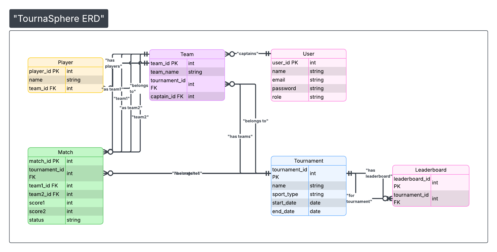

# ER Diagram  
TournaSphere – College Tournament Management System  

## Description

This ER diagram represents the database schema of the TournaSphere system.

Main Entities:

- User
- Tournament
- Team
- Player
- Match
- Leaderboard

Relationships:

- One Tournament has many Teams.
- One Tournament has many Matches.
- One Team has many Players.
- One Tournament has one Leaderboard.
- Each Match references two Teams.

Primary and foreign key relationships are defined to maintain referential integrity.

