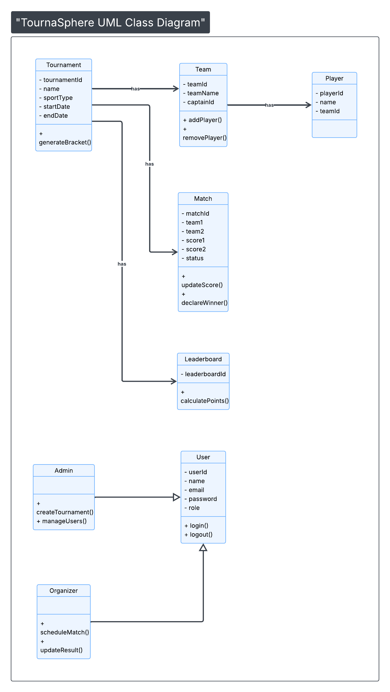

# Class Diagram  
TournaSphere – College Tournament Management System  

## Description

This class diagram represents the core classes, relationships, and inheritance structure of the TournaSphere system.

The system follows object-oriented design principles including inheritance, encapsulation, and abstraction.

Key Classes:

- User (Base Class)
- Admin (extends User)
- Organizer (extends User)
- Tournament
- Team
- Player
- Match
- Leaderboard

The diagram also represents:

- One Tournament has many Teams
- One Tournament has many Matches
- One Team has many Players
- Match connects exactly two Teams
- Tournament has one Leaderboard

