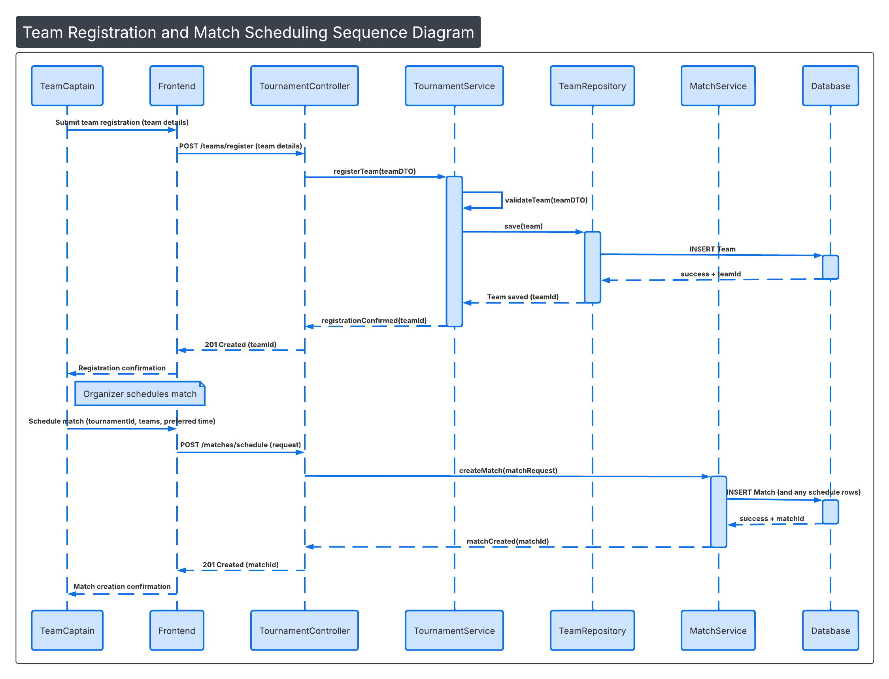

# Sequence Diagram  
TournaSphere – College Tournament Management System  

## Main End-to-End Backend Flow  
(Team Registration → Match Scheduling → Result Update → Leaderboard Calculation)

## Description

This sequence diagram represents the layered backend architecture of TournaSphere.

It demonstrates how requests flow through:

- Controller Layer
- Service Layer
- Repository Layer
- Database

Flow Covered:

1. Team Captain registers a team.
2. Organizer schedules a match.
3. Match results are updated.
4. Leaderboard is recalculated.

This reflects clean architecture and separation of concerns in backend design.

