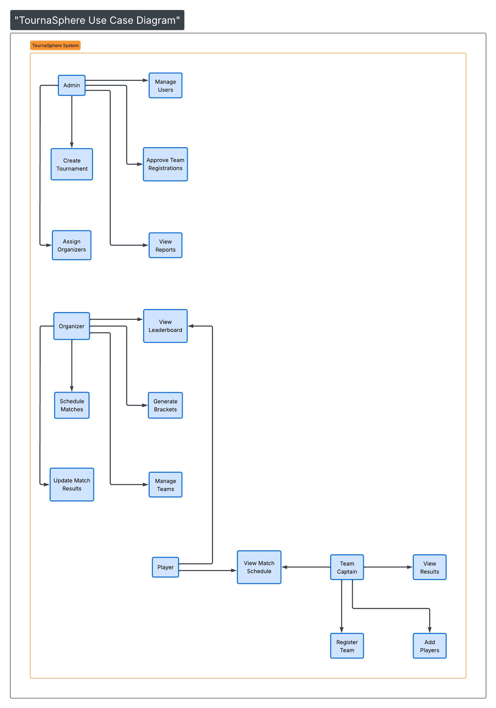

# Use Case Diagram  
TournaSphere – College Tournament Management System  

## Actors

- Admin
- Organizer
- Team Captain
- Player

## Description

This use case diagram illustrates the interactions between different actors and the TournaSphere system.

- Admin manages tournaments and users.
- Organizer schedules matches and updates results.
- Team Captain registers teams and manages players.
- Player views tournament information and leaderboard.

